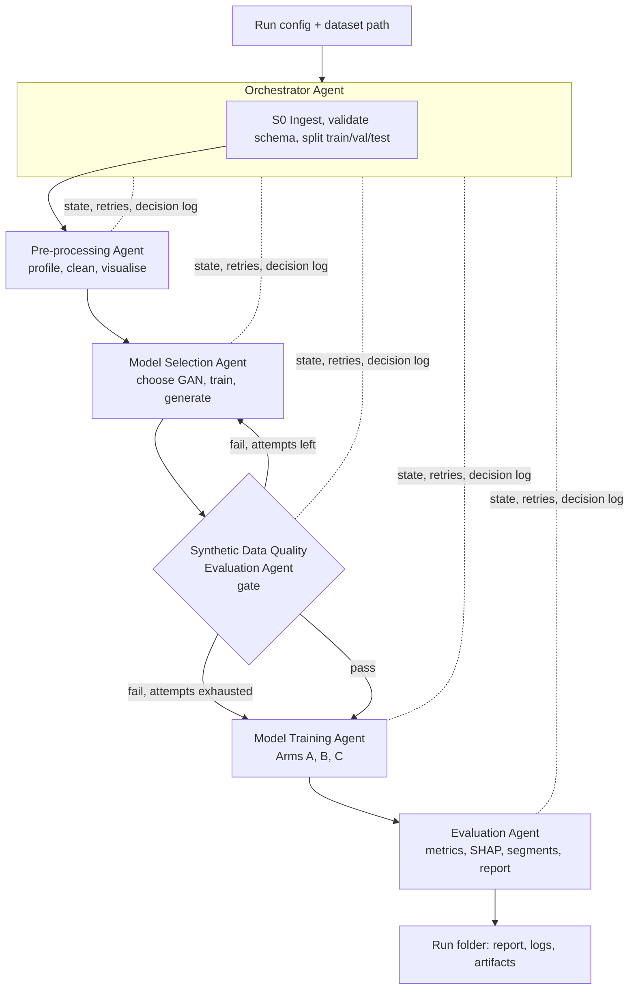

# Agentic GAN Framework: System Architecture

Team 23, Columbia Data Science Capstone with TD Bank. Draft v0.1 for the mentor meeting on 2 October 2026. Tracks GitHub issue #4.

## 1. Purpose and scope

This document defines the agents in the system, what each one is responsible for, what it takes in and puts out, and how the orchestrator moves a run from raw data to a final report. It is the blueprint the team builds from. It does not choose a framework (issue #13) and does not contain implementation code.

The system answers one question: does GAN-generated data improve a downstream model, and can an automated pipeline decide that reliably and document the decision? To answer it, every run compares three data pipelines on the same held-out real test set:

| Arm | Training data | What it tells us |
|---|---|---|
| A. Original | Raw training split, minimal encoding only | Baseline with no data work |
| B. Cleaned | Training split after profiling, cleaning and imputation | Value of conventional data repair |
| C. GAN-augmented | Arm B training split plus accepted synthetic records | Value of synthetic data over and above cleaning |

An optional Arm D (SMOTE oversampling on Arm B) is worth adding, because a reviewer will ask whether a GAN beats a simple oversampler. It costs little. See open question 5.

## 2. Design principles

1. **Deterministic where it matters, LLM where it helps.** Anything that decides the outcome of the experiment (splits, which GAN to use, whether synthetic data is accepted, which model wins) is a coded rule with logged inputs. The LLM is used for bounded tasks only (section 6).
2. **Real data is the only evaluation data.** The train, validation and test split is made once, before any cleaning or GAN training. Synthetic records are added to the training set only. Validation and test sets never contain synthetic rows.
3. **The GAN never sees the test set.** The generator is trained on the training split only, so a gain in Arm C cannot come from leakage.
4. **Typed handoffs.** Each agent receives and returns a schema-validated object (Pydantic) pointing to artifacts on disk. The orchestrator rejects an output that fails validation.
5. **Everything is logged.** Each decision is written with its inputs, the rule applied, and the outcome.
6. **Failures are results.** If synthetic data fails the quality gate, the run records that and continues without augmentation. A weak or negative result is reported, as the mentors asked.
7. **Synthetic data is always labelled.** Every synthetic file carries an `is_synthetic` column and a metadata header. It is never merged with real data without that flag.

## 3. System overview



The orchestrator owns control flow and state. Sub-agents do not call each other. They return results to the orchestrator, which decides the next step. This keeps retries, logging and failure handling in one place.

### Shared state

Each run writes to `runs/<run_id>/`:

```
runs/<run_id>/
  config.yaml              resolved config, seeds, package versions
  manifest.json            index of every artifact with path, hash, producing agent
  decisions.jsonl          one line per decision: agent, rule, inputs, outcome, rationale
  data/                    split files, cleaned files, synthetic files (is_synthetic=1)
  profile/                 profile.json, plots
  synthetic/               generator checkpoint, attempt history
  quality/                 quality_report.json, plots
  models/                  fitted models, per-arm metrics
  explain/                 SHAP outputs, segment tables
  report/                  final_report.md, tables
```

A run can be reproduced from `config.yaml` and the raw file.

## 4. Orchestrator Agent (issue #5)

**Purpose.** Run the pipeline end to end, enforce the rules in section 2, and keep the audit trail.

**Inputs.** `RunConfig`: dataset path and name, target column, positive class, seed list, split ratios, quality-gate thresholds, retry limit, GAN search bounds, list of candidate models.

**Responsibilities.**

1. Validate the config and the dataset schema (column names, types, target present, row count).
2. Create the stratified train/validation/test split (default 60/20/20, stratified on the target, fixed seed) and write it to disk. This is a tool call, not an LLM step.
3. Call each sub-agent in order, validate its output object, and write a decision-log entry.
4. Apply the gate logic: on a failed quality gate, re-invoke the Model Selection Agent with adjusted settings, up to `max_attempts` (default 3). After that, mark Arm C as `NOT_AVAILABLE` and continue.
5. Handle failures: agent timeout, schema-validation error or exception gives one retry, then marks the stage `FAILED` and stops the run with a partial report.
6. Assemble the manifest and hand the final state to the Evaluation Agent.

**Outputs.** `manifest.json`, `decisions.jsonl`, final `RunState` (status per stage, attempt counts).

**Tools.** `validate_config`, `validate_schema`, `split_data`, `write_manifest`, `log_decision`, plus the sub-agents themselves.

**Decision logic.** Fully deterministic: stage order, retry counts, gate routing. No LLM call decides control flow.

**Success.** All stages `SUCCESS` or `SKIPPED` with a reason, and a manifest in which every referenced artifact exists and its hash matches.

## 5. Sub-agents

### 5.1 Pre-processing Agent (issue #6)

**Purpose.** Produce a profiled, cleaned version of the real data and document every treatment.

**Inputs.** Train, validation and test files from S0; config. The profile and the fitted treatments come from the training split only. Validation and test are transformed with the training-fitted treatments.

**Responsibilities.**

1. Profile: types, cardinality, missing and sentinel values (such as `unknown`, `-1`), duplicates, class balance, numeric distributions and outliers, correlations. Write `profile.json` and plots.
2. Missingness analysis: classify each affected column by how much is missing and what the placeholder means.
3. Clean: apply treatments by rule (below). Fit on train, apply to all three splits.
4. Write the data-treatment log: one row per column with the issue found, the treatment, and the reason.

**Treatment rules (proposed, to be tuned after EDA).**

| Condition | Treatment |
|---|---|
| Placeholder is informative (e.g. `poutcome = unknown`, about 82% of rows, mostly no prior campaign) | Keep as its own category. Do not impute. |
| Placeholder is a true gap, under 5% of rows | Mode (categorical) or median (numeric) imputation |
| Placeholder is a true gap, 5% or more | Model-based imputation (for example iterative or kNN), plus a missing-indicator flag |
| Sentinel numeric value (e.g. `pdays = -1`) | Replace with NaN plus a separate indicator column |
| Exact duplicate rows | Report, and drop only inside the training split |
| Outliers | Flag, do not remove by default. Winsorise only if a rule in the config says so |
| Leakage-prone feature (`duration`, known only after the call) | Excluded from the model feature set by config, and documented |

**Outputs.** `PreprocessOutput`: paths to the Arm A files (raw, encoded only) and Arm B files (cleaned), `profile.json`, plots, the treatment log, and the fitted transformer.

**Tools.** `profile_dataframe`, `detect_placeholders`, `impute`, `encode`, `plot_distributions`, `write_treatment_log`.

**Decision logic.** Rule table above. The LLM may write the plain-language summary of the profile. It does not choose treatments.

**Success.** No unresolved NaN in Arm B, every column has a treatment-log row, and train-only fitting is confirmed by the fitted transformer's recorded row count.

### 5.2 Model Selection Agent (issue #7)

**Purpose.** Choose the right generator for the data, train it, and produce synthetic records.

**Inputs.** Arm B training split and `profile.json`; the retry count and the previous attempt's quality report, if any.

**Responsibilities.**

1. Extract data characteristics: column-type mix, row count, class imbalance, and whether a defensible temporal structure exists (an entity identifier and a time index with at least `min_steps` observations per entity).
2. Select the generator by rule (below) and write the rationale to the decision log.
3. Train the generator on the training split only, using conditional sampling on the target so minority-class records can be requested directly.
4. Generate synthetic records at the requested augmentation levels (target positive rate, e.g. 20%, 35%, 50%), set `is_synthetic = 1`, and store the generator checkpoint.
5. On a retry, adjust training settings inside the allowed bounds using the previous quality report (more epochs, different batch size or `pac`, different discriminator steps).

**Selection rules (proposed).**

| Data characteristics | Generator |
|---|---|
| Mixed continuous and categorical columns, no entity/time structure | CTGAN (default) |
| Entity ID plus time index, enough steps per entity | TimeGAN |
| Mostly numeric, smooth distributions, CTGAN fails the gate twice | WGAN-GP or TableGAN as a documented fallback |
| Fewer than `min_rows` (config, start at 2,000) | No GAN. Report that the dataset is too small |

For the primary dataset, the rules choose CTGAN. `bank-full` has no customer identifier, so no per-customer sequences exist and TimeGAN is not selected. `bank-additional-full` is date-ordered but still has no entity key. Building campaign-level sequences from it would be a modelling assumption we would have to defend, so TimeGAN stays an optional extension tied to a second dataset (issue #3).

**Outputs.** `GeneratorOutput`: chosen generator, rationale, hyperparameters, checkpoint path, synthetic files per augmentation level, training-loss history.

**Tools.** `describe_data_characteristics`, `train_ctgan`, `train_timegan`, `train_fallback_gan`, `sample_synthetic`.

**Decision logic.** Selection is rule-based. On a retry, the LLM may propose new hyperparameters, but only values inside bounds fixed in the config, and the proposal is logged. Training itself is a tool call.

**Success.** Training completes, the checkpoint loads, and synthetic files match the real schema (columns, types, category sets).

### 5.3 Synthetic Data Quality Evaluation Agent (issue #8)

**Purpose.** Decide whether the synthetic data is good enough to train on, and say why. This agent is the gate.

**Inputs.** Real training split, real held-out data (validation), synthetic files, config thresholds.

**Checks.**

| Dimension | Metrics | Compared against |
|---|---|---|
| Fidelity, univariate | KS (numeric), Wasserstein (numeric), JS divergence (categorical) per column | Real training split |
| Fidelity, joint | Pairwise correlation difference (Pearson and Cramér's V), mean absolute difference of the correlation matrices | Real training split |
| Utility | TSTR (train on synthetic, test on real) and TRTR (train on real, test on real), using the same classifier. Report the AUC and PR-AUC gap | Real validation split |
| Privacy | Distance to closest record (synthetic to real training) against the same distance for real validation rows. Exact-duplicate count. | Real validation split |
| Sanity | Category sets, value ranges, impossible combinations (rule list in config, e.g. `age >= 18`) | Schema |
| Label balance | Achieved positive rate against the requested rate | Request |

**Gate logic (starting values, to be calibrated on the real data in EDA).**

- Mean per-column KS and JS below 0.10, with no single column above 0.25.
- Correlation-matrix mean absolute difference below 0.10.
- TSTR AUC within 0.05 of TRTR AUC.
- Median distance-to-closest-record for synthetic rows not smaller than for real validation rows, and zero exact duplicates of training rows.
- Zero sanity violations after the config rule list.

If any hard check fails, the gate returns `FAIL` with the failing metrics. The orchestrator then retries the Model Selection Agent, which receives this report.

**Outputs.** `QualityReport`: per-check values, thresholds, pass/fail, overall verdict, and the augmentation levels that passed. Plots: per-column real vs synthetic distributions, correlation heatmaps.

**Tools.** `ks_test`, `js_divergence`, `wasserstein`, `correlation_diff`, `tstr_trtr`, `dcr_privacy`, `sanity_rules`, `plot_comparison`.

**Decision logic.** Deterministic. The verdict is computed from the thresholds. The LLM only writes the prose summary of the report and never changes the verdict.

**Success.** All metrics computed with no NaN, and a verdict recorded with the thresholds that produced it.

### 5.4 Model Training Agent (issue #9)

**Purpose.** Train the same set of models on each arm under identical conditions.

**Inputs.** Arm A and Arm B files, accepted synthetic files (if the gate passed), config.

**Responsibilities.**

1. Build the training set for each arm: A (raw), B (cleaned), C (cleaned plus synthetic at each accepted augmentation level). Optional D (SMOTE).
2. For each arm, train logistic regression, random forest, gradient boosting, XGBoost and LightGBM. Neural nets are optional.
3. Tune with the same search budget per arm, selecting on the real validation split only.
4. Repeat for each seed in the config (default 5) so results carry a spread.
5. Fit probability calibration on validation if the config requests it.
6. Save models and predictions on validation and test.

**Outputs.** `TrainingOutput`: for each arm, model, seed: model path, chosen hyperparameters, validation and test predictions.

**Tools.** `build_arm_dataset`, `fit_model`, `tune_model`, `calibrate`, `save_predictions`.

**Decision logic.** Deterministic. Same search space, folds and budget for every arm so that arms are comparable.

**Success.** Every arm, model and seed has predictions saved, and no synthetic row appears in any validation or test file (checked by the `is_synthetic` flag).

### 5.5 Evaluation Agent (issue #10)

**Purpose.** Turn the predictions into a comparison across arms, explain the models, and produce the report.

**Inputs.** `TrainingOutput`, `QualityReport`, treatment log, decision log, manifest.

**Responsibilities.**

1. Predictive metrics on the real test set: ROC-AUC, PR-AUC, precision, recall, F1, lift at top decile, KS statistic, calibration (Brier score, reliability curve), train-test gap. Mean and standard deviation across seeds.
2. Arm comparison: difference of each arm from A and from B, with a paired test or confidence interval across seeds. State plainly when a difference is within noise.
3. Explainability: SHAP for the best model per arm. Compare feature-importance rankings across arms (rank correlation of mean absolute SHAP), and list features whose rank changes by more than a set margin.
4. Segment analysis: metrics by age band, job, marital status and education, to look for bias amplification or segments where augmentation hurts.
5. Report generation: the final report, built from the result files.

**Report rules.** The LLM writes prose from structured result files only. Every number in the report is inserted from a result file by a template or checked against one, and a check script fails the run if a quoted number is not found in the results. The report must include a section on negative or inconclusive results, the data-treatment log, the quality report, limitations, and the ethical statements from the proposal.

**Outputs.** `final_report.md` (and PDF export), model comparison table, SHAP plots, segment tables.

**Tools.** `compute_metrics`, `compare_arms`, `shap_analysis`, `segment_metrics`, `render_report`, `verify_report_numbers`.

**Decision logic.** Deterministic for numbers and comparisons. The LLM writes the narrative within the fixed report outline.

**Success.** Report generated, number verification passes, all required sections present.

## 6. Where the LLM is used

| Agent | LLM task | Not delegated to the LLM |
|---|---|---|
| Orchestrator | None for control flow | Stage order, retries, gate routing |
| Pre-processing | Plain-language profile summary | Treatment choice |
| Model Selection | Hyperparameter proposals on retry, within bounds | Generator choice, training |
| Quality Evaluation | Prose summary | Verdict |
| Model Training | None | All |
| Evaluation | Report narrative | Metrics, comparisons, SHAP |

This split is deliberate. It keeps the experiment reproducible, makes the agent decisions auditable, and limits the LLM to places where wording or a bounded search helps. It is also the answer to the mentor request to add deterministic rules and evaluation criteria (issue #12).

## 7. Handoff contracts

| From | To | Object | Key fields |
|---|---|---|---|
| Orchestrator | Pre-processing | `SplitOutput` | train/val/test paths, target, seed |
| Pre-processing | Model Selection | `PreprocessOutput` | arm A/B paths, profile path, treatment log |
| Model Selection | Quality Evaluation | `GeneratorOutput` | generator, rationale, checkpoint, synthetic paths |
| Quality Evaluation | Orchestrator | `QualityReport` | metrics, thresholds, verdict, passing augmentation levels |
| Orchestrator | Model Training | `TrainingRequest` | arm file paths, accepted synthetic paths or none |
| Model Training | Evaluation | `TrainingOutput` | models, predictions per arm, model, seed |
| Evaluation | Orchestrator | `EvaluationOutput` | metrics tables, report path, verification status |

Every object has a `status` field (`SUCCESS`, `RETRY`, `FAILED`, `SKIPPED`), a `warnings` list and the artifact paths. These are Pydantic models in a shared `schemas` module.

## 8. Failure handling

| Failure | Response |
|---|---|
| Schema validation fails on an agent output | One retry of that agent, then stage `FAILED` |
| Quality gate fails | Retry Model Selection up to `max_attempts` with adjusted settings. Then Arm C is `NOT_AVAILABLE`, the run continues, and the report states why |
| GAN training diverges or collapses (loss non-finite, near-constant output) | Counts as a failed attempt |
| Dataset too small or no valid generator for the data | Skip generation, record the reason |
| Arm C does not beat Arm B | Not an error. Reported as a result |
| Any stage `FAILED` | Stop, write a partial report with the decision log |

## 9. Example run: Bank Marketing

1. S0: load `bank-full.csv` (45,211 rows, 17 inputs, about 11.7% positive). Validate schema, split 60/20/20 stratified.
2. Pre-processing: profile; keep `unknown` as a category for `poutcome`, treat `pdays = -1` as a sentinel, decide on `job`, `education` and `contact` unknowns by the rules, exclude `duration` from modelling features. Produce Arm A and Arm B files and the treatment log.
3. Model Selection: no entity or time key, mixed types, enough rows, so CTGAN. Train on the cleaned training split with conditional sampling on `y`. Generate sets at 20%, 35% and 50% positive rate.
4. Quality Evaluation: run the checks for each set. Suppose the 50% set fails the TSTR check and the others pass. Passing levels go forward and the failure is recorded.
5. Model Training: train five models by five seeds on A, B, C20 and C35 (and D if included) with identical search budgets.
6. Evaluation: test-set metrics with spread, arm comparison, SHAP stability, segment tables, report with a limitations section.

## 10. Mapping to workstreams

| Component | GitHub issue | Owners per meeting notes |
|---|---|---|
| Architecture map | #4 | Team |
| Orchestrator | #5 | Haasita, Raghav |
| Pre-processing | #6 | Akriti, Arshnoor, Haasita |
| Model Selection | #7 | Akriti, all |
| Quality Evaluation | #8 | Haasita, Raghav |
| Model Training | #9 | Arshnoor, Kyle |
| Evaluation and report | #10 | Arshnoor, Kyle |
| Deterministic rules and eval criteria | #12 | Team (this document proposes starting values) |
| Framework choice | #13 | Team |

Issue #6 on GitHub currently lists only Akriti and #7 only Akriti. The table follows the meeting notes. The GitHub assignees should be updated to match.

## 11. Framework note

The design is a fixed graph of stages with one conditional loop (the quality gate). That maps naturally onto a graph-based orchestrator such as LangGraph (agents as nodes, `RunState` as shared state, the gate as a conditional edge, retry count in state). The OpenAI Agents SDK is also workable, using handoffs, though it is less natural for a deterministic pipeline with a fixed loop. Plain Python with Pydantic would work as well and has the fewest dependencies. Pydantic is needed in all cases for the typed handoffs. The agent specifications above do not depend on the choice.

## 12. Open questions for the mentors

1. The meeting notes list DCGAN for non-time-series data. DCGAN is designed for images. For tabular data the candidates are CTGAN, TableGAN and WGAN-GP. Should we exclude DCGAN, or is an image dataset in scope?
2. `bank-full` has few true missing values (mostly `unknown` placeholders). To test the "data repair" part of the project title, may we inject controlled missingness (MCAR and MAR at 5%, 15%, 30%) into the real data and measure how well each repair method and the GAN recover it? Otherwise Arm B differs little from Arm A.
3. Should `duration` be excluded from modelling? The UCI documentation says it is not known before a call and makes a model unrealistic. We propose excluding it and reporting a with-duration run as a sensitivity check.
4. Which second dataset should carry the TimeGAN extension? We need an entity key and a time index. It would be useful to hear whether TD has a public dataset in mind. (Issue #3.)
5. Is a SMOTE arm (Arm D) acceptable as a baseline against the GAN?
6. Quality-gate thresholds are our starting values. Are there fidelity or utility thresholds TD uses that we should adopt instead?
7. Does the Model Selection Agent also own GAN training, as in the meeting notes, or should GAN training be a separate agent?
8. Compute: is the $100 per person in Google Cloud credit sufficient for CTGAN across seeds and augmentation levels, or should we plan for a smaller grid?

## 13. Next steps

1. Review this document in the 2 October meeting and settle the open questions.
2. Finalise the agent specifications and the schemas module (issue #11).
3. Agree the framework (issue #13).
4. Calibrate the quality-gate thresholds and treatment rules against the EDA results (issues #2, #12).
5. Implement the pipeline end to end with stub agents first, then replace the stubs one at a time.
